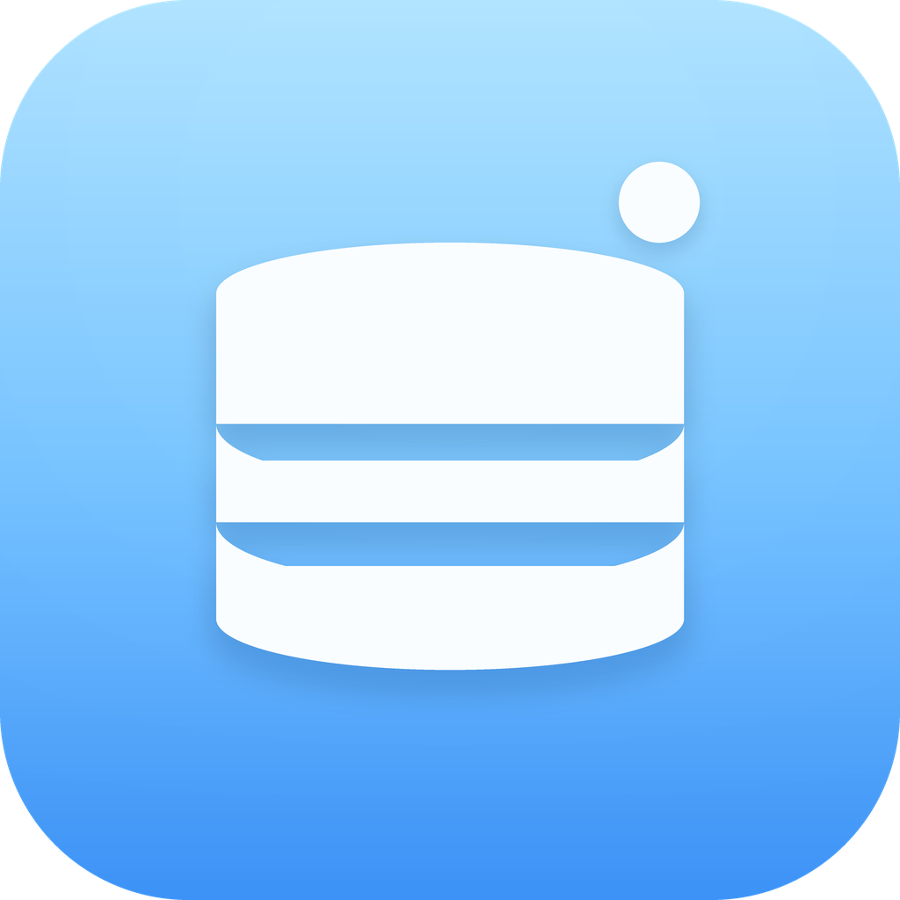

# MiniDB


<p align="center">
  
</p>

一款 AI 增强的数据库管理桌面应用，基于 Wails、Go、React 和 TypeScript 构建。它面向高效数据库浏览、接近原生桌面应用的操作体验，以及能理解 schema 上下文、解释 SQL、生成查询、检查数据并在明确请求时安全执行只读 SQL 的 AI 助手。

MiniDB 的界面设计参考了 TablePlus。TablePlus 简洁克制的布局、接近原生应用的质感，以及高效顺手的数据库操作流程，为数据库工具树立了很高的体验标准。MiniDB 是独立开源项目，与 TablePlus 没有关联，也未获得其背书。

**语言：** 简体中文 | [English](README.zh-CN.md)

<p align="center">
  
</p>

## 项目亮点

- **现代桌面数据库客户端**：连接管理、数据库切换、多工作区、多标签页、表数据浏览、分页、排序、筛选、行预览和右键菜单。
- **AI 数据库助手**：支持 OpenAI 兼容 API，可进行自然语言生成 SQL、SQL 解释、错误诊断、数据洞察、表文档生成和会话式问答。
- **工具调用与安全执行**：AI 会话支持 ReAct 工具调用、流式状态、工具时间线、表/列模糊匹配、DDL/统计/样例/画像读取、EXPLAIN，以及只读 SQL 自动执行保护。
- **结构与数据编辑**：支持表结构查看与编辑、索引创建/删除、行新增/修改/删除、批量提交与回滚。
- **导出与文档**：支持 CSV、JSON、SQL INSERT 流式导出；支持 Markdown 表文档编辑和 AI 生成文档。
- **中英文界面**：内置简体中文与英文，支持跟随系统语言或手动切换。
- **本地优先**：连接配置、文档、设置和日志保存在本机；数据库密码和 AI 密钥会在本地存储前加密。

## 支持的数据库

| 数据库 | 说明 |
| --- | --- |
| MySQL | 原生 MySQL 驱动 |
| PostgreSQL | 支持 `sslmode` 配置 |
| SQLite | 通过本地数据库文件连接 |
| TiDB | MySQL 协议兼容连接 |
| StarRocks | MySQL 协议兼容连接，针对预编译限制做了适配 |

## 功能概览

| 模块 | 能力 |
| --- | --- |
| 连接管理 | 新建、编辑、删除、测试连接；环境标签；颜色标识；本地加密存储 |
| 数据浏览 | 表/视图列表、分页数据表格、排序、条件筛选、原始 SQL 筛选、JSON 预览、行详情 |
| SQL 编辑器 | Monaco Editor、语法高亮、格式化、压缩、反转义、执行当前/选中/全部语句、多结果标签页 |
| 结构编辑 | 字段编辑、索引管理、DDL 查看、结构变更提交、schema 索引刷新 |
| AI 助手 | 流式对话、schema 感知、表/工具提及、AI 生成/修复 SQL、错误自动修复、Mermaid 预览 |
| 数据导出 | CSV、JSON、SQL INSERT；大表分批流式导出；进度展示与取消 |
| 应用体验 | 深浅色主题、紧凑布局、命令面板、SQL 历史/收藏、日志查看、自动更新 |

## 快速开始

### 环境要求

- Go 1.25+
- Node.js 18+
- pnpm 10+
- Wails CLI v3 alpha
- macOS 10.15+ 或 Windows 10/11 amd64

### 安装 Wails CLI

```bash
set -a && . ./project.env && set +a
go install github.com/wailsapp/wails/v3/cmd/wails3@${WAILS_VERSION}
```

### 安装依赖

```bash
cd frontend && pnpm install && cd ..
go mod download
```

### 启动开发模式

```bash
wails3 dev -config ./build/config.yml
```

### 配置 AI

打开应用后进入 `设置 -> AI 配置`：

- `Base URL` 默认为 `https://api.openai.com/v1`
- `API Key` 使用你的 OpenAI 兼容服务密钥
- `Model` 可填写 `gpt-4o` 或其他兼容模型名称
- `System Prompt` 可自定义回答语言、SQL 风格和安全约束

## 构建与验证

修改 Go 服务签名后先生成绑定：

```bash
wails3 generate bindings -clean=true -ts
```

本地完整验证：

```bash
go test ./...
cd frontend && pnpm test && pnpm build
wails3 generate bindings -clean=true -ts
wails3 build
```

macOS 打包：

```bash
wails3 task package:darwin ARCH=arm64
./scripts/build.sh --arch arm64
```

Windows 构建依赖 `github.com/mattn/go-sqlite3` 和 CGO 环境；建议在原生 Windows + MSYS2/MinGW，或 CI/Docker 交叉编译环境中验证。

## 发布与自动更新

项目已包含 GitHub Actions 工作流：

- `.github/workflows/ci.yml`：运行 Go 测试、前端测试、绑定生成和前端构建。
- `.github/workflows/release.yml`：推送 `vX.Y.Z` tag 后构建 macOS DMG、Windows 安装包、自动更新包、`update.json` 和校验文件。

发布新版本：

```bash
./scripts/set-version.sh 1.0.1
git tag v1.0.1
git push origin v1.0.1
```

自动更新会从 GitHub Releases 下载当前平台对应的压缩包，校验 SHA-256 后提示重启安装。

## 数据与安全

| 内容 | 默认位置 |
| --- | --- |
| 应用数据 | `~/.minidb/data.db` |
| 本地加密密钥 | `~/.minidb/secret.key` |
| 运行日志 | `~/.minidb/logs/` |

安全边界：

- 数据库密码、AI Key 和自定义 AI 请求头在写入 BoltDB 前会使用本机密钥加密。
- AI 自动执行只允许单条只读 SQL，并拒绝写操作、多语句和 `EXPLAIN ANALYZE` 等高风险场景。
- AI 能看到当前连接的 schema 上下文和你发送的问题；请不要把敏感业务数据发送给不可信模型服务。

## 常用快捷键

| 快捷键 | 功能 |
| --- | --- |
| `Cmd/Ctrl + K` | 全局搜索 / 命令面板 |
| `Cmd/Ctrl + T` | 新建查询标签页 |
| `Cmd/Ctrl + W` | 关闭当前标签页 |
| `Cmd/Ctrl + ,` | 打开设置 |
| `Cmd/Ctrl + Enter` | 执行当前或选中 SQL |
| `Cmd/Ctrl + Shift + Enter` | 执行全部 SQL |
| `Cmd/Ctrl + Shift + F` | 格式化 SQL |
| `Cmd/Ctrl + S` | 保存 SQL |
| `Space` | 预览选中行 |
| `Esc` | 关闭弹窗 |

## 项目结构

```text
minidb/
├── main.go                         # Wails 入口
├── internal/
│   ├── ai/                         # OpenAI 兼容客户端与 AI 能力
│   ├── app/                        # Wails 应用、窗口和生命周期
│   ├── appdata/                    # 用户数据路径
│   ├── database/                   # 连接、元数据、查询、SQL 方言和结构变更
│   ├── export/                     # CSV / JSON / SQL 导出
│   ├── schemaindex/                # schema 索引与刷新
│   ├── storage/                    # BoltDB 与本地密钥加密
│   ├── updater/                    # 自动更新
│   └── version/                    # 版本信息
├── services/                       # Wails 绑定服务
├── frontend/
│   ├── src/components/             # 布局、表格、编辑器、AI、设置等组件
│   ├── src/i18n/                   # zh-CN / en-US 文案
│   ├── src/stores/                 # Zustand 状态
│   └── package.json
├── docs/INSTALL.md                 # 安装说明
├── scripts/                        # 版本、构建、发布辅助脚本
├── build/                          # Wails 构建配置与平台资源
└── .github/workflows/              # CI 与 Release
```

## 贡献

欢迎提交 Issue、功能建议和 Pull Request。建议 PR 前先运行：

```bash
go test ./...
cd frontend && pnpm test && pnpm build
wails3 generate bindings -clean=true -ts
wails3 build
```

贡献时请尽量遵循现有代码风格，避免混用 npm/Yarn 锁文件；前端依赖统一使用 pnpm。

## 许可证

[MIT](LICENSE)
