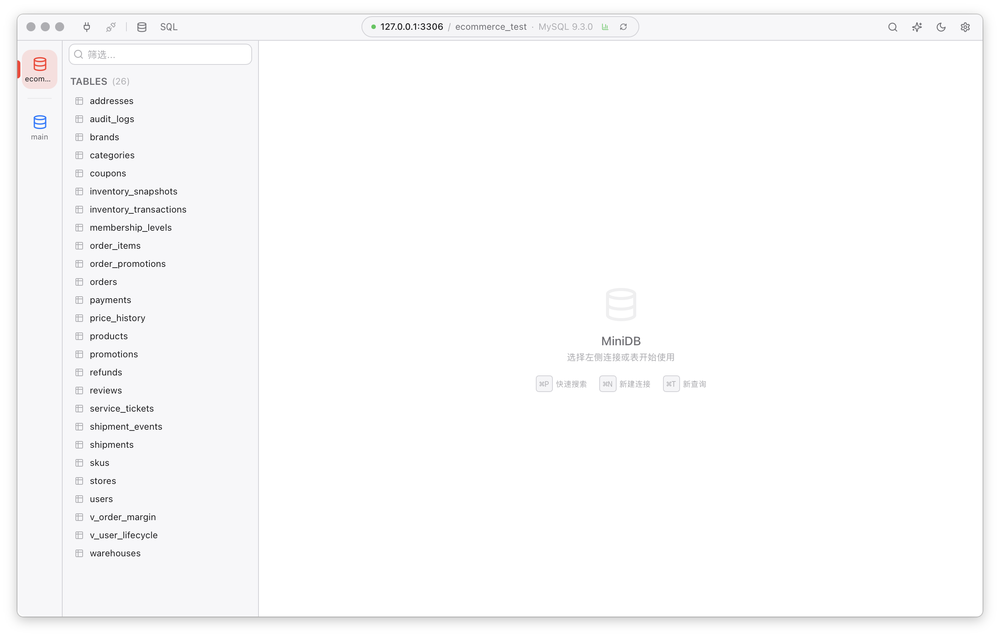

# MiniDB


MiniDB is an AI-powered desktop database client built with Wails, Go, React, and TypeScript. It focuses on fast database browsing, a polished macOS-style workflow, and a practical AI assistant that can understand schema context, explain SQL, generate queries, inspect data, and safely run read-only SQL when requested.

MiniDB's interface design is inspired by TablePlus, whose clean layout, native desktop feel, and efficient database workflow set a high bar for database tools. MiniDB is an independent open-source project and is not affiliated with or endorsed by TablePlus.

**Language:** [简体中文](README.md) | English

<p align="center">
  
</p>

## English

### Highlights

- **Modern desktop database client**: connection management, database switching, workspaces, tabs, table browsing, pagination, sorting, filters, row preview, and context menus.
- **AI database assistant**: works with OpenAI-compatible APIs for natural-language-to-SQL, SQL explanation, error diagnosis, data insights, table documentation, and chat-based database Q&A.
- **Tool calling with safety controls**: streaming ReAct workflow, tool timeline, fuzzy table/column matching, DDL/stats/sample/profile inspection, EXPLAIN, and guarded read-only SQL execution.
- **Data and structure editing**: table structure view/editing, index creation/deletion, row insert/update/delete, batch commit, and rollback.
- **Export and documentation**: streaming CSV, JSON, and SQL INSERT exports; Markdown table docs with AI generation.
- **Bilingual UI**: Simplified Chinese and English, with system-language detection and manual switching.
- **Local-first storage**: connections, docs, settings, and logs stay on your machine; database passwords and AI secrets are encrypted before being stored locally.

### Supported Databases

| Database | Notes |
| --- | --- |
| MySQL | Native MySQL driver |
| PostgreSQL | Supports `sslmode` |
| SQLite | Connects through a local database file |
| TiDB | MySQL-compatible protocol |
| StarRocks | MySQL-compatible protocol with handling for prepare-statement limitations |

### Feature Overview

| Area | Capabilities |
| --- | --- |
| Connections | Create, edit, delete, test, tag, color-code, and locally encrypt saved connections |
| Browsing | Tables/views, paginated grid, sorting, structured filters, raw SQL filters, JSON preview, row details |
| SQL editor | Monaco Editor, syntax highlighting, format, minify, unescape, run current/selected/all statements, multi-result tabs |
| Structure | Columns, indexes, DDL, structure commits, schema index refresh |
| AI assistant | Streaming chat, schema-aware answers, table/tool mentions, SQL generation/fixing, error auto-fix, Mermaid preview |
| Export | CSV, JSON, SQL INSERT, batched streaming export, progress display, cancellation |
| App experience | Light/dark themes, compact layout, command palette, SQL history/favorites, logs, auto update |

### Quick Start

#### Requirements

- Go 1.25+
- Node.js 18+
- pnpm 10+
- Wails CLI v3 alpha
- macOS 10.15+ or Windows 10/11 amd64

#### Install Wails CLI

```bash
set -a && . ./project.env && set +a
go install github.com/wailsapp/wails/v3/cmd/wails3@${WAILS_VERSION}
```

#### Install dependencies

```bash
cd frontend && pnpm install && cd ..
go mod download
```

#### Run in development

```bash
wails3 dev -config ./build/config.yml
```

#### Configure AI

Open `Settings -> AI Config` in the app:

- `Base URL` defaults to `https://api.openai.com/v1`
- `API Key` is your OpenAI-compatible provider key
- `Model` can be `gpt-4o` or another compatible model name
- `System Prompt` controls response language, SQL style, and safety preferences

### Build and Verify

Generate bindings after changing Go service signatures:

```bash
wails3 generate bindings -clean=true -ts
```

Run the full local verification:

```bash
go test ./...
cd frontend && pnpm test && pnpm build
wails3 generate bindings -clean=true -ts
wails3 build
```

Package for macOS:

```bash
wails3 task package:darwin ARCH=arm64
./scripts/build.sh --arch arm64
```

Windows builds use `github.com/mattn/go-sqlite3` and require CGO. Validate Windows amd64 artifacts in native Windows with MSYS2/MinGW, or in a CI/Docker cross-compilation environment.

### Release and Auto Update

The repository includes GitHub Actions workflows:

- `.github/workflows/ci.yml`: Go tests, frontend tests, binding generation, and frontend build.
- `.github/workflows/release.yml`: builds macOS DMGs, Windows installer, update archives, `update.json`, and checksums when a `vX.Y.Z` tag is pushed.

Create a release:

```bash
./scripts/set-version.sh 1.0.1
git tag v1.0.1
git push origin v1.0.1
```

The in-app updater downloads the matching archive from GitHub Releases, verifies SHA-256, and prompts the user to restart and install.

### Data and Security

| Item | Default location |
| --- | --- |
| App data | `~/.minidb/data.db` |
| Local secret key | `~/.minidb/secret.key` |
| Logs | `~/.minidb/logs/` |

Security boundaries:

- Database passwords, AI keys, and custom AI headers are encrypted before being written to BoltDB.
- AI auto execution only allows one read-only SQL statement and rejects writes, multi-statement input, and risky cases such as `EXPLAIN ANALYZE`.
- The AI provider can receive schema context and the prompts you send. Do not send sensitive business data to an untrusted model provider.

### Keyboard Shortcuts

| Shortcut | Action |
| --- | --- |
| `Cmd/Ctrl + K` | Global search / command palette |
| `Cmd/Ctrl + T` | New query tab |
| `Cmd/Ctrl + W` | Close current tab |
| `Cmd/Ctrl + ,` | Open settings |
| `Cmd/Ctrl + Enter` | Run current or selected SQL |
| `Cmd/Ctrl + Shift + Enter` | Run all SQL |
| `Cmd/Ctrl + Shift + F` | Format SQL |
| `Cmd/Ctrl + S` | Save SQL |
| `Space` | Preview selected row |
| `Esc` | Close dialogs |

### Repository Layout

```text
minidb/
├── main.go                         # Wails entry point
├── internal/
│   ├── ai/                         # OpenAI-compatible client and AI features
│   ├── app/                        # Wails app, window, and lifecycle
│   ├── appdata/                    # User data paths
│   ├── database/                   # Connections, metadata, queries, SQL dialects, structure changes
│   ├── export/                     # CSV / JSON / SQL export
│   ├── schemaindex/                # Schema index and refresh state
│   ├── storage/                    # BoltDB and local secret encryption
│   ├── updater/                    # Auto update
│   └── version/                    # Version metadata
├── services/                       # Wails-bound services
├── frontend/
│   ├── src/components/             # Layout, table, editor, AI, settings, and UI components
│   ├── src/i18n/                   # zh-CN / en-US copy
│   ├── src/stores/                 # Zustand stores
│   └── package.json
├── docs/INSTALL.md                 # Installation guide
├── scripts/                        # Version, build, and release helpers
├── build/                          # Wails config and platform assets
└── .github/workflows/              # CI and release workflows
```

### Contributing

Issues, feature requests, and pull requests are welcome. Before opening a PR, please run:

```bash
go test ./...
cd frontend && pnpm test && pnpm build
wails3 generate bindings -clean=true -ts
wails3 build
```

Please follow the existing code style and use pnpm for frontend dependencies. Do not mix npm or Yarn lockfiles into the repository.

### License

[MIT](LICENSE)
